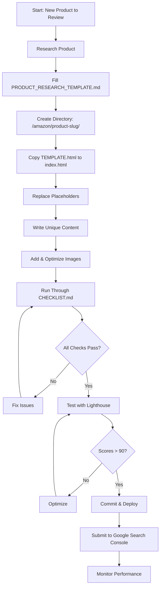

# Amazon Review Pages Documentation Index

**Welcome!** This is your complete guide to creating SEO-optimized, high-converting Amazon affiliate review pages.

## 📖 Table of Contents

1. [Quick Navigation](#quick-navigation)
2. [Getting Started](#getting-started)
3. [Documentation Files](#documentation-files)
4. [Workflow Overview](#workflow-overview)
5. [Best Practices](#best-practices)
6. [Support & Resources](#support--resources)

---

## Quick Navigation

### 🚀 For Beginners
Start here if you're creating your first review page:

1. **[QUICK_START.md](./QUICK_START.md)** - 30-minute walkthrough
2. **[PRODUCT_RESEARCH_TEMPLATE.md](./PRODUCT_RESEARCH_TEMPLATE.md)** - Gather all needed info
3. **[TEMPLATE.html](./TEMPLATE.html)** - Copy and customize

### 📚 For Advanced Users
Deep dive into SEO and optimization:

1. **[AMAZON_REVIEW_GUIDE.md](./AMAZON_REVIEW_GUIDE.md)** - Comprehensive SEO strategy
2. **[VISUAL_GUIDE.md](./VISUAL_GUIDE.md)** - Design system and layout
3. **[CHECKLIST.md](./CHECKLIST.md)** - Pre-deployment validation

### 🛠️ Reference Materials
Quick lookups and templates:

1. **[README.md](./README.md)** - Directory overview
2. **This file** - Complete documentation index

---

## Getting Started

### The 3-Step Quick Process

```
1. Research → Use PRODUCT_RESEARCH_TEMPLATE.md
2. Create   → Copy TEMPLATE.html and customize
3. Deploy   → Follow CHECKLIST.md
```

### Estimated Time
- **First review**: 30-40 minutes
- **Subsequent reviews**: 15-20 minutes
- **With experience**: 10-15 minutes

---

## Documentation Files

### 📄 QUICK_START.md
**Purpose**: Step-by-step guide for beginners  
**Length**: ~8,000 words  
**Best For**: First-time review page creators

**What's Inside**:
- 10-step process with time estimates
- Find & replace shortcuts
- Common mistakes to avoid
- Time-saving tips
- Success metrics to track

**When to Use**: Creating your very first review page

---

### 📄 PRODUCT_RESEARCH_TEMPLATE.md
**Purpose**: Structured data collection template  
**Length**: ~10,000 words  
**Best For**: Organizing product information before writing

**What's Inside**:
- All required fields for a complete review
- Category-specific specification sections
- SEO keyword planning worksheet
- FAQ brainstorming template
- Pre-writing checklist

**When to Use**: Before you start writing, gather all info here

---

### 📄 TEMPLATE.html
**Purpose**: Ready-to-use HTML review page template  
**Length**: ~31,000 characters (complete page)  
**Best For**: The foundation of every new review

**What's Inside**:
- Complete HTML structure with semantic tags
- Embedded CSS (no external files needed)
- All required schemas (Product, FAQ, Breadcrumb)
- Responsive design (mobile-first)
- Interactive elements (sticky CTA, smooth scroll)
- Clearly marked placeholders ([BRACKETS])

**When to Use**: Copy this file to start every new review

**Key Features**:
- ✅ SEO-optimized meta tags
- ✅ Structured data (JSON-LD)
- ✅ Mobile-responsive
- ✅ Core Web Vitals optimized
- ✅ Affiliate compliance built-in
- ✅ Conversion-focused design

---

### 📄 AMAZON_REVIEW_GUIDE.md
**Purpose**: Comprehensive SEO and conversion strategy guide  
**Length**: ~14,000 words  
**Best For**: Understanding the "why" behind the template

**What's Inside**:
- Page architecture principles
- Meta tag optimization
- Keyword research strategies
- Hook design psychology
- Visual engagement techniques
- Content depth guidelines
- Conversion optimization tactics
- Performance optimization tips
- Advanced SEO techniques

**When to Use**: Read once fully, then reference specific sections

**Key Sections**:
1. Page Intent & Architecture
2. Meta & Rich-Snippet SEO
3. Keyword Strategy
4. Hook Design & CTR Psychology
5. Visual Engagement & Dwell Time
6. Content Sections for Depth & Authority
7. Conversion Optimization
8. On-Page SEO Checklist
9. Testing Before Deployment
10. Commit & PR Guidelines

---

### 📄 CHECKLIST.md
**Purpose**: Pre-deployment validation checklist  
**Length**: ~8,700 words  
**Best For**: Final review before publishing

**What's Inside**:
- Pre-writing checklist
- Content structure checklist
- Meta tags checklist
- Structured data checklist
- Visual elements checklist
- CTA & affiliate links checklist
- SEO elements checklist
- Performance checklist
- Testing checklist
- Deployment checklist
- Post-launch monitoring

**When to Use**: Before deploying every review page

**Critical Checks**:
- ✅ All placeholders replaced
- ✅ Meta description ≤155 chars
- ✅ Affiliate links have rel="nofollow sponsored"
- ✅ All images have alt text
- ✅ Structured data validates
- ✅ Mobile-responsive
- ✅ Lighthouse scores >90

---

### 📄 VISUAL_GUIDE.md
**Purpose**: Visual structure and design system reference  
**Length**: ~17,000 words  
**Best For**: Understanding layout and design decisions

**What's Inside**:
- ASCII art page structure diagram
- Mobile view layout
- Complete color palette
- Typography scale
- Spacing system
- Shadow levels
- Interactive states
- Responsive breakpoints
- Gradient formulas
- Component specifications

**When to Use**: When customizing design or creating variants

**Visual Elements**:
- Page structure from top to bottom
- Mobile vs desktop layouts
- Color scheme with hex codes
- Typography hierarchy
- Spacing and shadows
- Interactive element behaviors

---

### 📄 README.md
**Purpose**: Amazon directory overview and quick reference  
**Length**: ~8,500 words  
**Best For**: Understanding the overall system

**What's Inside**:
- Directory structure overview
- Quick start summary
- Documentation index
- SEO targets and goals
- Template placeholder reference
- Page structure outline
- Design system summary
- Quality standards
- Testing requirements
- Tools and resources

**When to Use**: First read when exploring the directory

---

## Workflow Overview

### Standard Workflow



### File Usage Timeline

```
Day 0 - Research Phase:
├── Read: QUICK_START.md (if first time)
├── Read: AMAZON_REVIEW_GUIDE.md (skim key sections)
└── Fill: PRODUCT_RESEARCH_TEMPLATE.md

Day 1 - Creation Phase:
├── Copy: TEMPLATE.html
├── Customize: Replace all placeholders
├── Write: Original content
├── Reference: VISUAL_GUIDE.md (for design questions)
└── Validate: CHECKLIST.md

Day 2 - Testing Phase:
├── Test: Lighthouse scores
├── Test: Mobile responsiveness
├── Test: Rich results validation
└── Final check: CHECKLIST.md

Day 3 - Deployment:
├── Commit and push
├── Submit to Google Search Console
└── Monitor: Performance metrics
```

---

## Best Practices

### Content Quality

✅ **Do:**
- Write 2000+ words of unique content
- Include real-world use cases
- Be honest about pros and cons
- Add personal insights
- Use natural keyword distribution
- Create helpful FAQs
- Provide complete specifications

❌ **Don't:**
- Copy content from Amazon
- Keyword stuff
- Hide cons or limitations
- Use generic template text
- Skip image optimization
- Forget affiliate disclosure
- Ignore mobile users

### SEO Optimization

**Must-Haves**:
- One H1 with primary keyword
- 6-8 H2 sections
- Product schema (JSON-LD)
- FAQ schema (JSON-LD)
- Meta description ≤155 chars
- Canonical URL
- Open Graph tags
- Image alt text
- Mobile-responsive design

**Performance Targets**:
- Lighthouse Performance: >90
- Lighthouse SEO: >95
- LCP: <2.5s
- CLS: <0.1
- INP: <200ms

### Affiliate Compliance

**Required Elements**:
1. Disclosure banner at top of page
2. `rel="nofollow sponsored"` on all affiliate links
3. `target="_blank"` to open in new tab
4. Footer disclosure
5. Clear distinction from editorial content

---

## Support & Resources

### Internal Documentation
- **Quick Help**: [QUICK_START.md](./QUICK_START.md)
- **Complete Guide**: [AMAZON_REVIEW_GUIDE.md](./AMAZON_REVIEW_GUIDE.md)
- **Validation**: [CHECKLIST.md](./CHECKLIST.md)
- **Design Reference**: [VISUAL_GUIDE.md](./VISUAL_GUIDE.md)

### External Tools

**Validation**:
- [W3C HTML Validator](https://validator.w3.org/)
- [Google Rich Results Test](https://search.google.com/test/rich-results)
- [Schema Markup Validator](https://validator.schema.org/)

**Performance**:
- [Google Lighthouse](https://developers.google.com/web/tools/lighthouse) (Chrome DevTools)
- [PageSpeed Insights](https://pagespeed.web.dev/)
- [GTmetrix](https://gtmetrix.com/)

**SEO**:
- [Google Search Console](https://search.google.com/search-console)
- [Google Keyword Planner](https://ads.google.com/home/tools/keyword-planner/)

**Images**:
- [TinyPNG](https://tinypng.com/) - Image compression
- [Squoosh](https://squoosh.app/) - Image optimization
- [Remove.bg](https://www.remove.bg/) - Background removal

### Learning Resources
- [Google Search Central](https://developers.google.com/search)
- [Schema.org Documentation](https://schema.org/)
- [Web.dev](https://web.dev/) - Performance guides
- [MDN Web Docs](https://developer.mozilla.org/)

---

## Quick Reference

### Template Placeholders Priority

**Highest Priority** (Must Replace):
1. `[PRODUCT_NAME]` - Used throughout
2. `[AFFILIATE_LINK]` - All CTAs
3. `[SLUG]` - URLs and navigation
4. `[RATING]` & `[REVIEW_COUNT]` - Social proof
5. `[PRICE]` - Schema and display

**High Priority** (SEO Critical):
6. `[CATEGORY]` - Keywords and context
7. `[BRAND_NAME]` - Brand recognition
8. `[PRODUCT_IMAGE_PATH]` - Visual content
9. `[PUBLISH_DATE]` - Freshness signal
10. Meta descriptions and titles

**Medium Priority** (Content):
11. All `[FAQ_*]` placeholders
12. All `[PRO_*]` and `[CON_*]`
13. `[FEATURE_*]` content
14. `[SPEC_*]` values

**Lower Priority** (Polish):
15. Trust badges
16. CTA text variations
17. Alternative products
18. Hero badge text

### File Size Reference

| File | Size | Type |
|------|------|------|
| TEMPLATE.html | 31 KB | Template |
| AMAZON_REVIEW_GUIDE.md | 14 KB | Guide |
| VISUAL_GUIDE.md | 17 KB | Reference |
| PRODUCT_RESEARCH_TEMPLATE.md | 10 KB | Template |
| CHECKLIST.md | 9 KB | Checklist |
| QUICK_START.md | 8 KB | Guide |
| README.md | 8 KB | Overview |

**Total Documentation**: ~97 KB

---

## Troubleshooting

### Common Issues

**Problem**: Page not ranking  
**Solution**: 
1. Check Google Search Console for indexing
2. Verify structured data validity
3. Ensure content is unique and valuable
4. Build internal links from other pages

**Problem**: Lighthouse performance low  
**Solution**:
1. Optimize images (<200KB each)
2. Remove blocking JavaScript
3. Use system fonts
4. Preload critical resources

**Problem**: Placeholders still showing  
**Solution**:
1. Search file for `[` character
2. Use Find & Replace for common placeholders
3. Review CHECKLIST.md validation section

**Problem**: Rich results not showing  
**Solution**:
1. Test with Google Rich Results Test
2. Validate JSON-LD syntax
3. Ensure all required fields present
4. Wait 1-2 weeks for Google to process

---

## Update History

### Version 1.0 (January 2025)
- Initial documentation suite created
- 7 comprehensive documents
- HTML template with full SEO optimization
- Complete workflow and guidelines established
- Example review page (Green Soul Jupiter Pro) published

---

## Next Steps

1. **First Time?** → Start with [QUICK_START.md](./QUICK_START.md)
2. **Ready to Create?** → Use [PRODUCT_RESEARCH_TEMPLATE.md](./PRODUCT_RESEARCH_TEMPLATE.md)
3. **Need Details?** → Read [AMAZON_REVIEW_GUIDE.md](./AMAZON_REVIEW_GUIDE.md)
4. **Before Deploying?** → Check [CHECKLIST.md](./CHECKLIST.md)
5. **Design Questions?** → See [VISUAL_GUIDE.md](./VISUAL_GUIDE.md)

---

**Maintained by**: Kaaviya SivaKumar  
**Last Updated**: January 2025  
**Version**: 1.0

**Questions?** Refer to individual documentation files for detailed answers.
